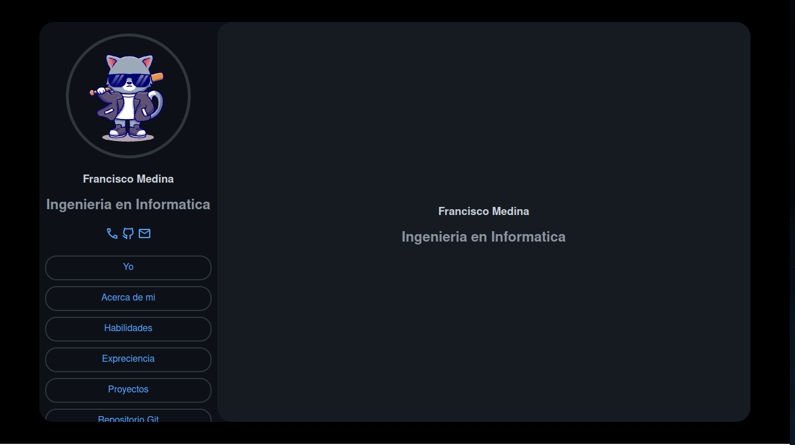

# Mi Portafolio Personal

Este es el repositorio de mi portafolio personal

## Vista Previa

## Contenido

- **HTML y CSS**: La estructura y el diseño están desarrollados utilizando HTML para el contenido y CSS para estilizar y dar formato.

- **Secciones**:
  - **Yo**: Información personal y título.
  - **Acerca de mí**: Descripción detallada sobre mí y mis habilidades.
  - **Habilidades**: Lista de habilidades técnicas.
  - **Experiencia**: Experiencia laboral detallada.
  - **Proyectos**: Descripción de proyectos realizados con enlaces a sus repositorios.

## Uso

1. Clona este repositorio en tu máquina local.
2. Abre el archivo `index.html` en tu navegador web.

## Tecnologías Utilizadas

- HTML
- CSS

## Autor

- Heimdall004

---

© 2024 Heimdall004. Todos los derechos reservados.
